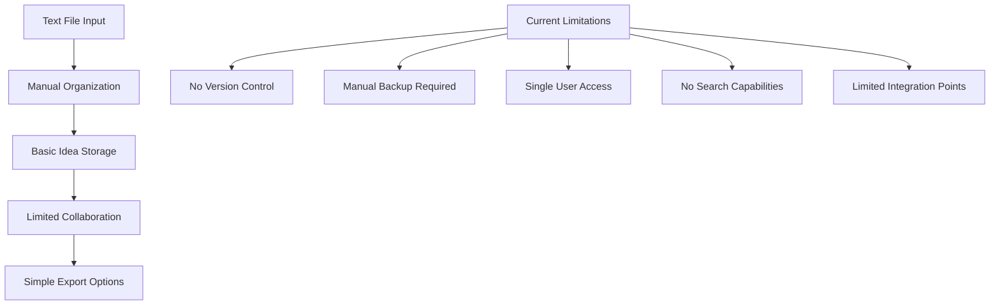
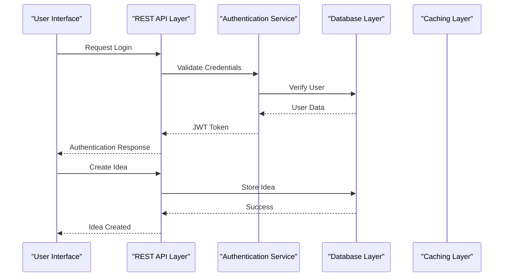
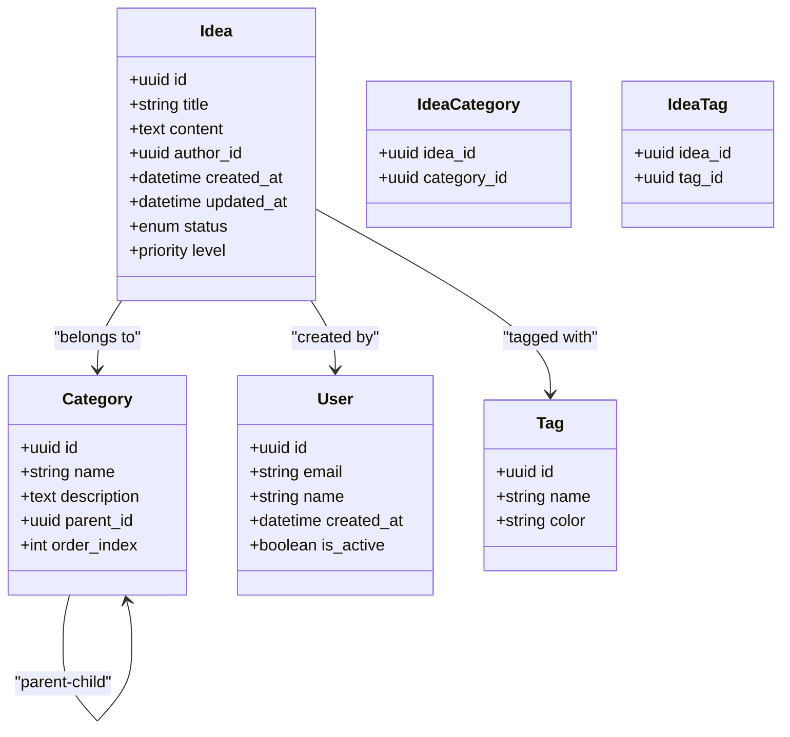
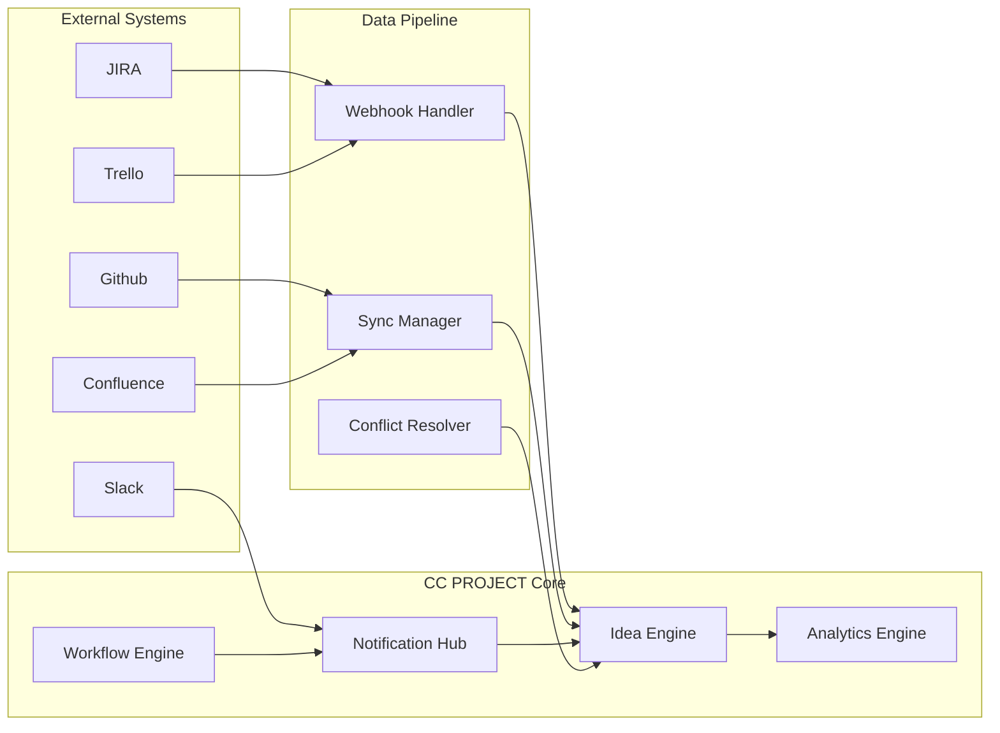
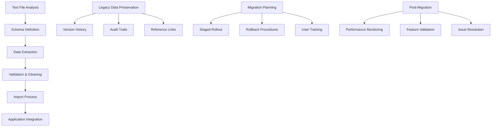

# Development Roadmap

<cite>
**Referenced Files in This Document**
- [CC ideas.txt](file://CC ideas.txt)
</cite>

## Table of Contents
1. [Introduction](#introduction)
2. [Current State Analysis](#current-state-analysis)
3. [Proposed Enhancement Categories](#proposed-enhancement-categories)
4. [Technical Architecture Roadmap](#technical-architecture-roadmap)
5. [Integration Opportunities](#integration-opportunities)
6. [Timeline and Milestones](#timeline-and-milestones)
7. [Resource Requirements](#resource-requirements)
8. [Migration Strategy](#migration-strategy)
9. [Backward Compatibility](#backward-compatibility)
10. [Contributor Guidelines](#contributor-guidelines)
11. [Risk Assessment](#risk-assessment)
12. [Conclusion](#conclusion)

## Introduction

This development roadmap outlines the strategic direction for expanding the CC PROJECT from a simple text-based idea documentation system to a comprehensive project management and collaboration platform. The roadmap addresses the fundamental need to transform a basic text file approach into a scalable, feature-rich application while maintaining backward compatibility and developer productivity.

The current project exists as a single text file containing ideas, representing a minimal viable product that demonstrates the core concept. This roadmap provides a structured approach to enhance the system with modern development practices, collaborative features, and enterprise-grade functionality.

## Current State Analysis

The CC PROJECT currently operates as a text-based documentation system with the following characteristics:

**Diagram sources**
- [CC ideas.txt](file://CC ideas.txt)

Key limitations identified:
- Single-file text format with no database backing
- Manual organization and backup processes
- No collaborative features or user management
- Basic search and filtering capabilities
- Limited integration with external tools
- No version control or audit trails

**Section sources**
- [CC ideas.txt](file://CC ideas.txt)

## Proposed Enhancement Categories

### 1. Core Platform Enhancements

#### Web Interface Development
The foundation for a modern user experience requires a responsive web interface that supports:
- Real-time collaboration features
- Rich text editing capabilities
- Mobile-responsive design
- Cross-platform accessibility

#### Database Architecture
Implementation of a robust data model supporting:
- Idea storage with metadata
- User profiles and permissions
- Version history and audit trails
- Tagging and categorization systems

#### Authentication and Authorization
- Multi-factor authentication support
- Role-based access control
- OAuth integration for external services
- Session management and security

### 2. Advanced Feature Set

#### Idea Management System
- Hierarchical categorization with parent-child relationships
- Priority and status tracking
- Timeline and deadline management
- Resource allocation and assignment

#### Search and Discovery
- Full-text search across all content
- Advanced filtering by metadata
- Saved searches and notifications
- Intelligent recommendation algorithms

#### Export and Integration
- Multiple format exports (PDF, CSV, JSON)
- API-first architecture for third-party integrations
- Import capabilities from existing tools
- Real-time synchronization mechanisms

### 3. Collaboration Features

#### Team Management
- User invitation and onboarding
- Permission matrices and role assignments
- Activity feeds and notifications
- Conflict resolution and approval workflows

#### Workflow Automation
- Automated routing based on categories
- Approval chains and escalation policies
- SLA tracking and alerts
- Reporting and analytics dashboards

## Technical Architecture Roadmap

### Phase 1: Foundation (Months 1-3)
Establish the core infrastructure and basic functionality:

**Diagram sources**
- [CC ideas.txt](file://CC ideas.txt)

### Phase 2: Feature Expansion (Months 4-8)
Implement advanced features and integrations:

**Diagram sources**
- [CC ideas.txt](file://CC ideas.txt)

### Phase 3: Enterprise Integration (Months 9-12)
Scale for organizational use and advanced integrations:

**Diagram sources**
- [CC ideas.txt](file://CC ideas.txt)

## Integration Opportunities

### Issue Tracking Systems
Integration with popular platforms enables seamless workflow continuity:

#### JIRA Integration
- Automatic ticket creation from ideas
- Status synchronization and updates
- Attachment and comment mirroring
- Custom field mapping for metadata

#### GitHub Issues
- Pull request integration for implementation tracking
- Milestone alignment with project phases
- Commit message linking for traceability
- Release automation triggers

#### Trello Board Synchronization
- Card creation and movement automation
- Label and checklist preservation
- Member assignment and notification
- Archive and cleanup workflows

### Creative Tools Ecosystem
Enhanced connectivity with design and documentation tools:

#### Confluence Integration
- Wiki page creation from approved ideas
- Template-based documentation generation
- Cross-reference linking and navigation
- Version control integration

#### Figma/Adobe Creative Suite
- Design brief creation from project requirements
- Asset library synchronization
- Review process integration
- Stakeholder feedback collection

### Communication Platforms
Seamless team coordination across collaboration tools:

#### Slack Integration
- Channel-based notifications and updates
- Interactive bot for idea submission
- Threaded discussions and approvals
- File sharing and attachment handling

#### Microsoft Teams
- Meeting scheduling integration
- Channel automation for updates
- Power Automate workflow triggers
- Shared workspace integration

## Timeline and Milestones

### Short-term Goals (0-3 months)
- Complete web interface MVP with basic CRUD operations
- Establish database schema and API endpoints
- Implement user authentication and authorization
- Deploy initial testing environment

### Medium-term Goals (3-8 months)
- Advanced search and filtering capabilities
- Collaborative editing and conflict resolution
- Export functionality and format support
- Basic reporting and analytics dashboard

### Long-term Vision (8-12 months)
- Full integration ecosystem with external tools
- Advanced workflow automation and approval chains
- Mobile application development
- Performance optimization and scalability enhancements

```mermaid
gantt
title CC PROJECT Development Timeline
dateFormat X
axisFormat %m/%y
section Phase 1: Foundation
Web Interface MVP :done, 1, 3
Database Setup :done, 1, 3
Authentication :done, 1, 3
Testing Environment :done, 2, 3
section Phase 2: Enhancement
Advanced Search :crit, 3, 6
Collaboration Features :crit, 4, 7
Export Functionality :crit, 5, 8
Analytics Dashboard :crit, 6, 8
section Phase 3: Integration
External Tool APIs :crit, 7, 10
Workflow Automation :crit, 8, 11
Mobile Application :crit, 9, 12
Performance Scaling :crit, 10, 12
```

## Resource Requirements

### Human Resources
- **Senior Developer (Full-stack)**: 1.0 FTE for core development
- **UI/UX Designer**: 0.5 FTE for interface design and user experience
- **DevOps Engineer**: 0.3 FTE for deployment and infrastructure
- **QA Specialist**: 0.2 FTE for testing and quality assurance

### Technology Stack
- **Backend**: Node.js/Express or Python/Django framework
- **Frontend**: React.js with modern hooks and state management
- **Database**: PostgreSQL with JSONB support for flexible schemas
- **Authentication**: OAuth 2.0 with JWT tokens
- **Caching**: Redis for session and frequently accessed data
- **Storage**: Cloud storage for file attachments and backups

### Infrastructure Requirements
- **Development**: Local development environment with Docker containers
- **Testing**: Staging environment with automated testing pipeline
- **Production**: Cloud hosting with auto-scaling and monitoring
- **Backup**: Automated backup and disaster recovery procedures

## Migration Strategy

### From Text-Based to Application
The transition from simple text files to a full application requires careful planning:

**Diagram sources**
- [CC ideas.txt](file://CC ideas.txt)

### Data Migration Approach
- **Batch Processing**: Initial import of existing ideas and metadata
- **Real-time Sync**: Live synchronization during transition period
- **Validation Layer**: Data integrity checks and conflict resolution
- **Fallback Mechanisms**: Graceful degradation if migration fails

### User Experience Continuity
- **Gradual Transition**: Maintain familiar text-based workflows alongside new features
- **Training Materials**: Comprehensive documentation and video tutorials
- **Support Channels**: Dedicated help desk and community forums
- **Feedback Loops**: Regular surveys and usability testing

## Backward Compatibility

### API Versioning Strategy
- **Semantic Versioning**: Major.minor.patch versioning for all endpoints
- **Deprecation Policy**: 6-month notice for breaking changes
- **Migration Guides**: Step-by-step instructions for version upgrades
- **Compatibility Layers**: Legacy endpoint support during transition periods

### Data Format Preservation
- **Export Formats**: Maintain ability to export in original text format
- **Metadata Preservation**: All original idea attributes and relationships
- **Reference Integrity**: Links and cross-references remain functional
- **Historical Data**: Complete audit trail of all modifications

### User Workflow Continuity
- **Familiar Interfaces**: Maintain recognizable patterns from current system
- **Shortcut Keys**: Keyboard shortcuts for power users
- **Bulk Operations**: Batch processing capabilities preserved
- **Custom Workflows**: Ability to customize and extend existing processes

## Contributor Guidelines

### Getting Started
1. **Environment Setup**: Clone repository and install dependencies
2. **Development Server**: Start local development server with hot reloading
3. **Code Style**: Follow established coding standards and conventions
4. **Testing**: Write comprehensive tests for new features

### Contribution Process
- **Issue Creation**: Use GitHub Issues for bug reports and feature requests
- **Pull Requests**: Submit PRs with clear descriptions and test coverage
- **Code Review**: Peer review process for all contributions
- **Documentation**: Update documentation for significant changes

### Development Standards
- **Branch Naming**: Feature branches follow `feature/short-description` pattern
- **Commit Messages**: Clear, descriptive commit messages with issue references
- **Testing Requirements**: All changes require passing tests and coverage reports
- **Security Review**: Critical security implications reviewed by maintainers

### Specialized Areas
- **Frontend Development**: React components with proper state management
- **Backend Services**: RESTful APIs with proper error handling
- **Database Schema**: Well-designed migrations and index strategies
- **DevOps**: CI/CD pipelines and deployment automation

## Risk Assessment

### Technical Risks
- **Scalability Challenges**: Database and API performance under load
- **Integration Complexity**: Third-party service reliability and API changes
- **Data Security**: Protection of sensitive project information and user data
- **System Reliability**: Availability and fault tolerance requirements

### Business Risks
- **Market Competition**: Alternative solutions and feature adoption rates
- **User Adoption**: Resistance to change from established workflows
- **Resource Allocation**: Budget constraints and timeline pressures
- **Regulatory Compliance**: Data protection and privacy regulations

### Mitigation Strategies
- **Performance Testing**: Load testing and capacity planning
- **Service Level Agreements**: SLAs with external service providers
- **Security Audits**: Regular security assessments and penetration testing
- **Backup and Recovery**: Comprehensive disaster recovery procedures

## Conclusion

The CC PROJECT represents a significant opportunity to transform a simple idea documentation system into a comprehensive project management and collaboration platform. The proposed roadmap balances immediate needs with long-term vision, ensuring sustainable growth while maintaining the core value proposition.

Success depends on careful execution of each phase, adequate resource allocation, and continuous engagement with the user community. The integration opportunities with existing development workflows position the platform to become an essential tool in modern project management ecosystems.

Key success factors include:
- Maintaining backward compatibility during transitions
- Prioritizing user experience and workflow integration
- Building robust technical foundations for future scaling
- Establishing clear governance and contribution guidelines
- Managing risks through comprehensive planning and testing

The development roadmap provides a structured approach to achieving these goals while remaining flexible enough to adapt to changing requirements and emerging technologies.