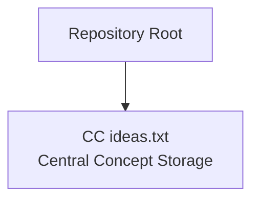
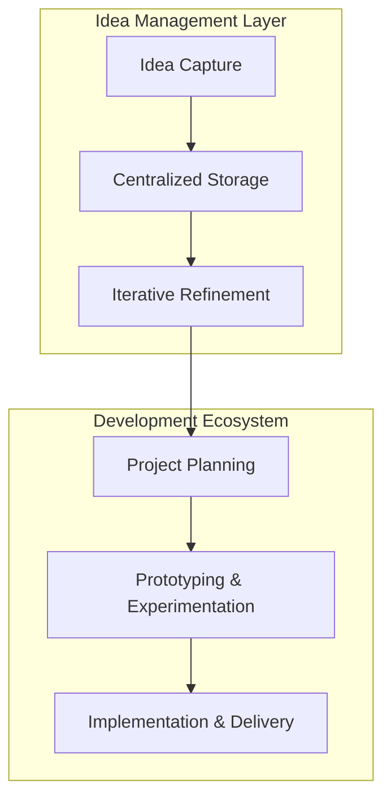

# Project Overview

<cite>
**Referenced Files in This Document**
- [CC ideas.txt](file://CC ideas.txt)
</cite>

## Table of Contents
1. [Introduction](#introduction)
2. [Project Structure](#project-structure)
3. [Core Components](#core-components)
4. [Architecture Overview](#architecture-overview)
5. [Detailed Component Analysis](#detailed-component-analysis)
6. [Dependency Analysis](#dependency-analysis)
7. [Performance Considerations](#performance-considerations)
8. [Troubleshooting Guide](#troubleshooting-guide)
9. [Conclusion](#conclusion)

## Introduction
This document presents the conceptual overview of the CC PROJECT, an idea documentation and concept storage platform designed to support creative thinking and project ideation. The platform serves as a foundation for capturing, organizing, and evolving innovative concepts—offering a structured approach to idea management that bridges creativity and actionable development planning.

At its core, CC PROJECT enables individuals and teams to systematically record and refine ideas, transforming raw inspiration into organized knowledge assets. It emphasizes:
- Idea capture: Structured documentation of concepts, motivations, and initial formulations
- Centralized storage: A unified repository for concepts to support ongoing exploration and iteration
- Foundation for development: A staging ground for ideas that may evolve into future projects, prototypes, or product roadmaps

The platform’s value proposition lies in its simplicity and focus on the early stages of innovation—where clarity, consistency, and accessibility of ideas are paramount. It is intended for creators, researchers, product designers, and development teams who recognize that strong ideas require deliberate documentation and thoughtful curation.

## Project Structure
The repository currently contains a single file dedicated to concept storage and documentation. This file serves as the central artifact for capturing and maintaining ideas, aligning with the platform’s goal of centralized concept storage.

**Diagram sources**
- [CC ideas.txt](file://CC ideas.txt)

**Section sources**
- [CC ideas.txt](file://CC ideas.txt)

## Core Components
- Central Concept Storage: The primary artifact for idea documentation and concept preservation. This file acts as a persistent record of captured concepts, enabling long-term tracking and iterative refinement.
- Idea Capture Workflow: A process for documenting new ideas, including initial formulation, motivation, and contextual notes. This workflow ensures that valuable insights are not lost and can be revisited during future planning sessions.
- Iterative Refinement: A mechanism for reviewing and improving existing concepts over time. This includes updating formulations, adding new perspectives, and aligning ideas with evolving goals or constraints.

These components collectively support the platform’s mission to transform creative impulses into structured, retrievable knowledge assets.

**Section sources**
- [CC ideas.txt](file://CC ideas.txt)

## Architecture Overview
The conceptual architecture of CC PROJECT centers on a single-file model for idea documentation. This minimalist approach emphasizes accessibility and portability while maintaining a clear separation between idea capture and subsequent development activities.

This architecture positions CC PROJECT as a foundational layer within the broader software development lifecycle. By capturing and refining ideas early, teams can reduce uncertainty, improve alignment, and accelerate decision-making in later phases.

[No sources needed since this diagram shows conceptual workflow, not actual code structure]

## Detailed Component Analysis
### Idea Capture
- Purpose: Provide a standardized method for recording new concepts, including initial thoughts, motivations, and contextual observations.
- Workflow: Capture begins with a concise statement of the idea, followed by supporting rationale and potential implications. This ensures that each concept is documented with sufficient context for future review.
- Output: A structured entry within the central concept storage file, preserving the original formulation alongside metadata such as creation date and authorship.

### Centralized Storage
- Purpose: Maintain a single, authoritative source for all documented concepts. This reduces fragmentation and improves discoverability across contributors and time.
- Features: Version-aware entries, cross-references between related concepts, and categorization aids to streamline retrieval and analysis.
- Benefits: Enables longitudinal tracking of idea evolution, supports team collaboration, and facilitates periodic audits of concept portfolios.

### Iterative Refinement
- Purpose: Improve and clarify concepts over time through structured review cycles. This includes validating feasibility, exploring alternatives, and aligning with strategic objectives.
- Process: Periodic reviews assess concept viability, update formulations, and integrate feedback from stakeholders. This continuous improvement cycle strengthens the quality of ideas entering later development phases.

**Section sources**
- [CC ideas.txt](file://CC ideas.txt)

## Dependency Analysis
The platform’s dependencies are intentionally minimal, focusing on the central concept storage file as the primary dependency for all idea-related activities. This design choice reduces complexity and enhances maintainability while preserving flexibility for future enhancements.

[No sources needed since this diagram shows conceptual relationships, not actual code structure]

## Performance Considerations
- Scalability: The single-file model scales well for small to medium-sized concept portfolios. As the number of entries grows, consider partitioning strategies or lightweight indexing to maintain responsiveness.
- Accessibility: Ensure that the central storage file remains readable and editable across platforms and tools. This supports broad contributor participation and reduces friction in documentation workflows.
- Maintenance: Establish periodic maintenance routines to archive stale concepts, consolidate duplicates, and update outdated entries. This preserves the quality and utility of the concept repository.

[No sources needed since this section provides general guidance]

## Troubleshooting Guide
- File Access Issues: If the central concept storage file becomes inaccessible, verify permissions and ensure the file is not locked by another process. Confirm that the repository path is correct and that the file exists in the expected location.
- Data Integrity: Regularly back up the central storage file to prevent accidental loss. Implement version control practices to track changes and enable rollback if necessary.
- Collaboration Conflicts: When multiple contributors edit the central storage file, establish a coordination protocol to avoid conflicts. Consider adopting a shared editing workflow or splitting contributions across separate files with later consolidation.

**Section sources**
- [CC ideas.txt](file://CC ideas.txt)

## Conclusion
CC PROJECT offers a focused, practical foundation for idea documentation and concept storage. By emphasizing systematic capture, centralized preservation, and iterative refinement, it supports both individual creators and collaborative teams in transforming inspiration into structured knowledge assets. As a bridge between ideation and development, CC PROJECT enables teams to make informed decisions, reduce risk, and accelerate progress toward meaningful outcomes.

[No sources needed since this section summarizes without analyzing specific files]